# 🌦️ API REST - Gestión de Clima

Este proyecto es una API RESTful desarrollada con [NestJS](https://nestjs.com/) y [TypeORM](https://typeorm.io/) utilizando una base de datos **SQLite**. Permite gestionar información climática, incluyendo ubicaciones geográficas, condiciones meteorológicas y consultas relacionadas. El proyecto está estructurado en una arquitectura por capas, ideal para prácticas de desarrollo limpio y escalable.

---

## 🚀 Instalación y ejecución

### 1. Clonar el repositorio

```bash
git clone https://github.com/EZMayk/Reposity-of-Aplicaciones/tree/ccbd4be0d5fb53660d7bc08c82a3679a6a12e6fc/Parcial_2/Practicas/practica_1

cd tu-repo
```
### 2. Instalar dependencias

```bash
npm install
```

### 3. Ejecutar el proyecto en modo desarrollo

```bash
npm run start:dev
```

> La API estará disponible en `http://localhost:3000` y se creará automáticamente la base de datos SQLite (`clima.db`) en la raíz del proyecto.

## 📡 Rutas HTTP de la API

### 📍 Ubicaciones (`/ubicaciones`)

| Método | Ruta                  | Descripción             |
|--------|------------------------|--------------------------|
| POST   | `/ubicaciones`         | Crear una ubicación      |
| GET    | `/ubicaciones`         | Obtener todas            |
| GET    | `/ubicaciones/:id`     | Obtener por ID           |
| PUT    | `/ubicaciones/:id`     | Actualizar ubicación     |
| DELETE | `/ubicaciones/:id`     | Eliminar ubicación       |

#### 🔄 Pruebas de los metodos http correspondientes

```json
{
  "ciudad": "Guayaquil",
  "pais": "Ecuador",
  "latitud": -2.17,
  "longitud": -79.92
}
```

---

### 🌤️ Climas (`/climas`)

| Método | Ruta            | Descripción                  |
|--------|------------------|-------------------------------|
| POST   | `/climas`        | Crear un clima               |
| GET    | `/climas`        | Listar todos los climas      |
| GET    | `/climas/:id`    | Obtener clima por ID         |
| PUT    | `/climas/:id`    | Actualizar clima             |
| DELETE | `/climas/:id`    | Eliminar clima               |

#### 🔄 Ejemplo JSON (POST)

```json
{
  "descripcion": "Soleado",
  "temperatura": 30,
  "humedad": 50,
  "viento": 12
}
```

---

### 📊 Consultas Climáticas (`/consultas`)

| Método | Ruta             | Descripción                             |
|--------|------------------|------------------------------------------|
| POST   | `/consultas`     | Crear una consulta de clima              |
| GET    | `/consultas`     | Listar todas las consultas               |
| GET    | `/consultas/:id` | Obtener consulta por ID                  |
| PUT    | `/consultas/:id` | Actualizar una consulta                  |
| DELETE | `/consultas/:id` | Eliminar una consulta                    |

#### 🔄 Ejemplo JSON (POST)

```json
{
  "fecha": "2025-06-26T12:00:00Z",
  "ubicacionId": 1,
  "climaId": 1
}
```

> ⚠️ Asegúrate de que los `ubicacionId` y `climaId` existan previamente.

---


## 🛠️ Tecnologías utilizadas

- [NestJS](https://nestjs.com/)
- [TypeORM](https://typeorm.io/)
- [SQLite](https://www.sqlite.org/)
- [class-validator](https://github.com/typestack/class-validator)
- [Thunder Client](https://www.thunderclient.com/) / Postman (para pruebas)

---

## ✅ Validaciones

Las entidades están protegidas con validaciones usando `class-validator`. Si faltan campos o los tipos no coinciden, el servidor responderá con errores `400 Bad Request` indicando qué propiedad es inválida.

---

## 🧪 Pruebas recomendadas

1. Crear una ubicación (POST `/ubicaciones`)
2. Crear un clima (POST `/climas`)
3. Crear una consulta (POST `/consultas`)
4. Listar resultados con GET
5. Editar con PUT
6. Eliminar con DELETE

---

## 📷 Pruebas con Thunder Client

### ✅ Pruebas de `Ubicacion`

#### POST
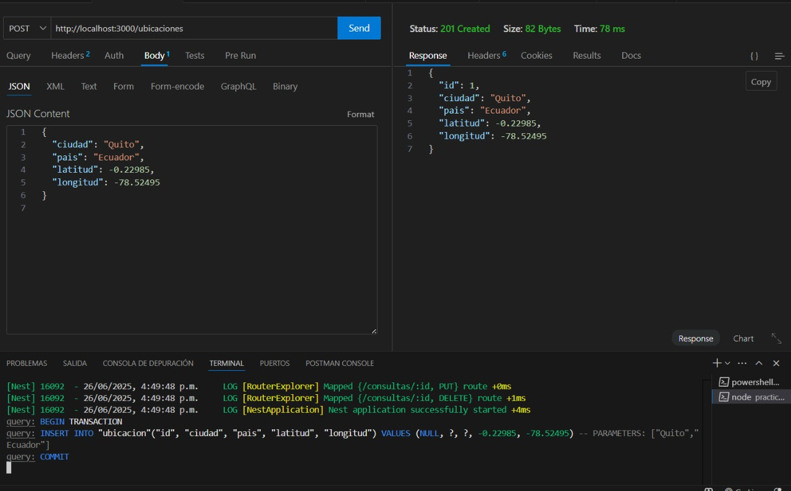

#### GET todas
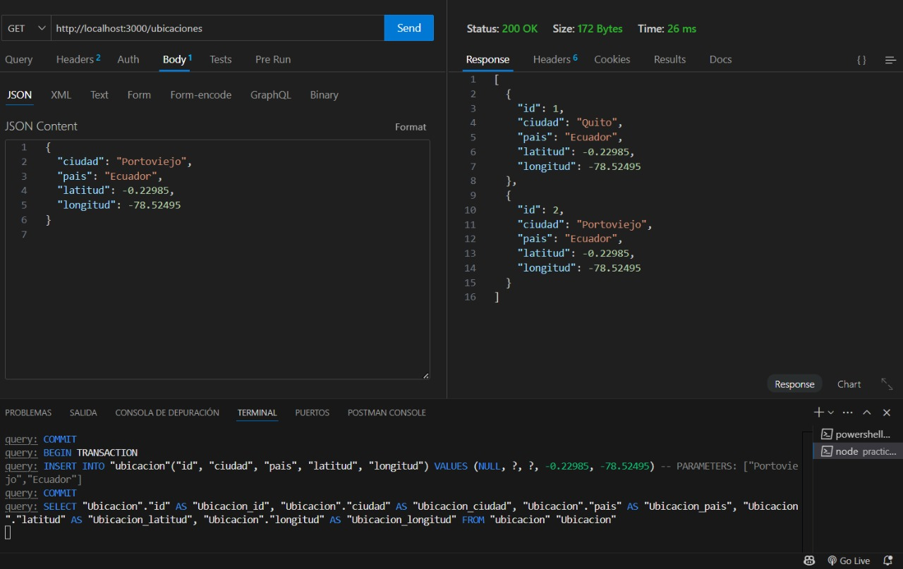

#### GET por ID
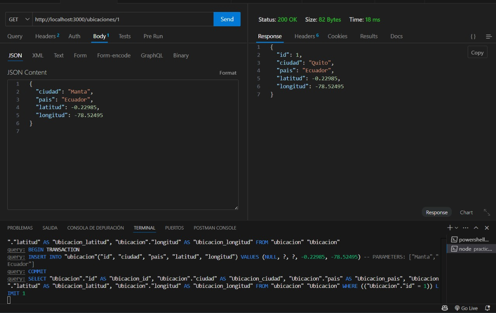

#### PUT
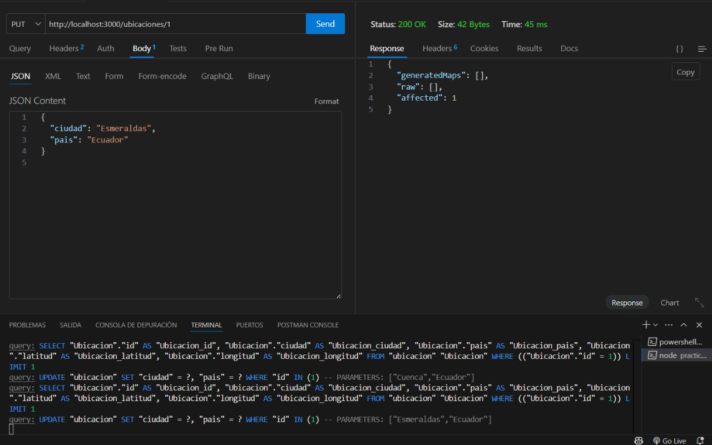

#### DELETE
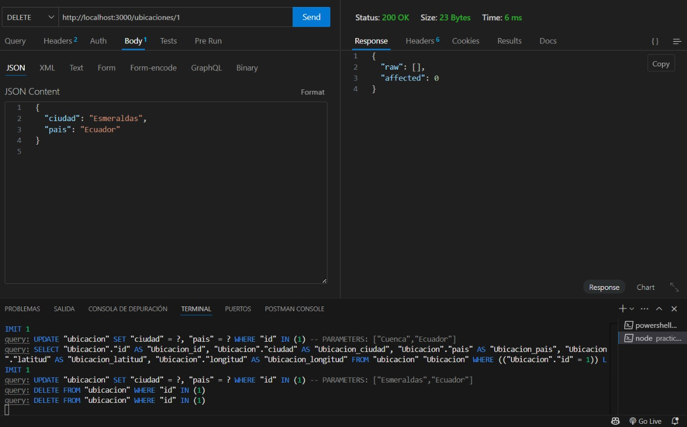

---

### ✅ Pruebas de `Clima`

#### POST
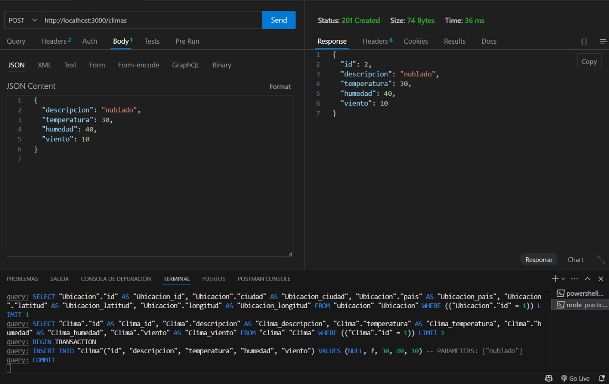

#### GET todas
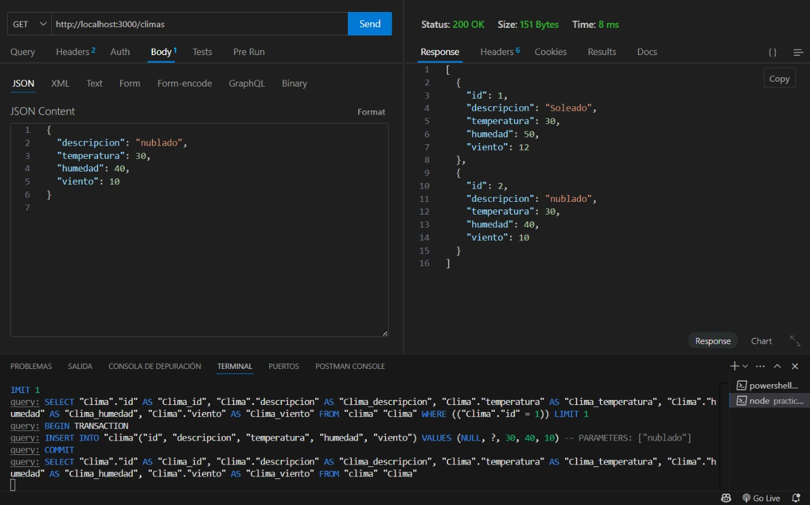

#### GET por ID
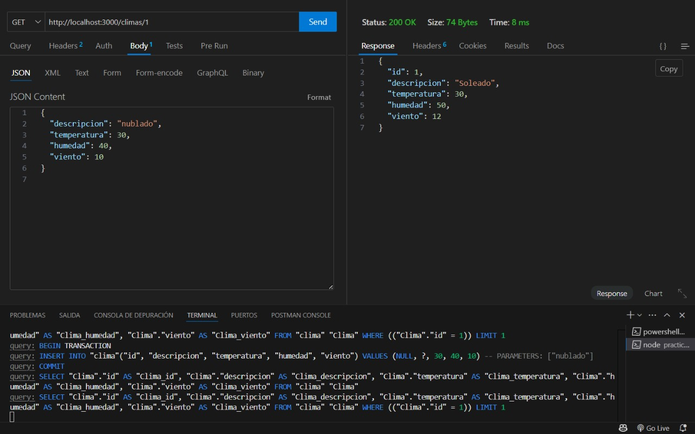

#### PUT
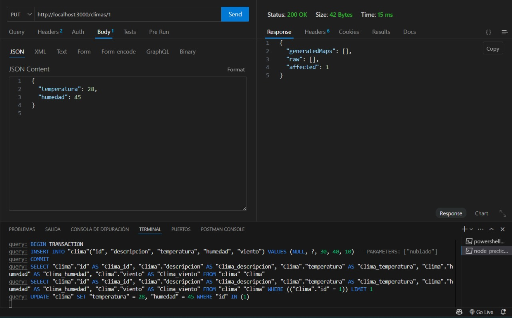

#### DELETE
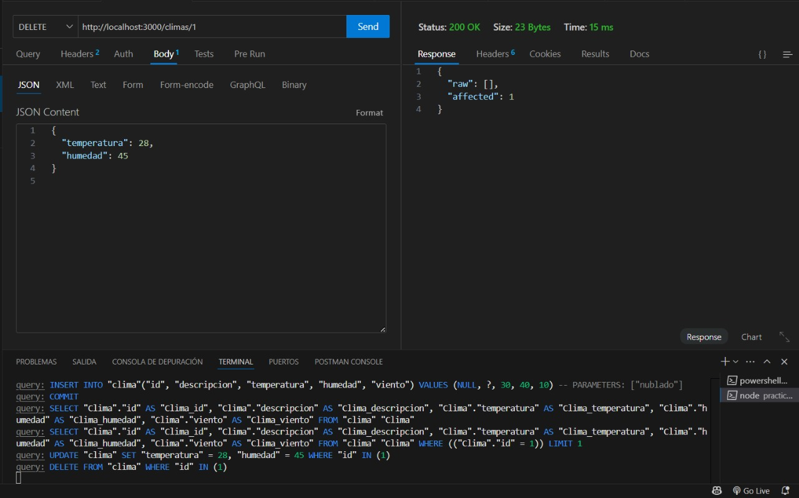

---

### ✅ Pruebas de `ConsultaClima`

#### POST
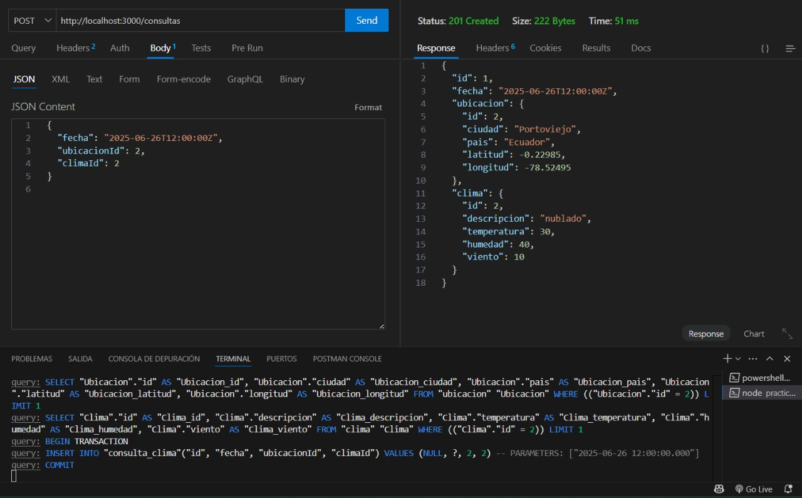

#### GET todas
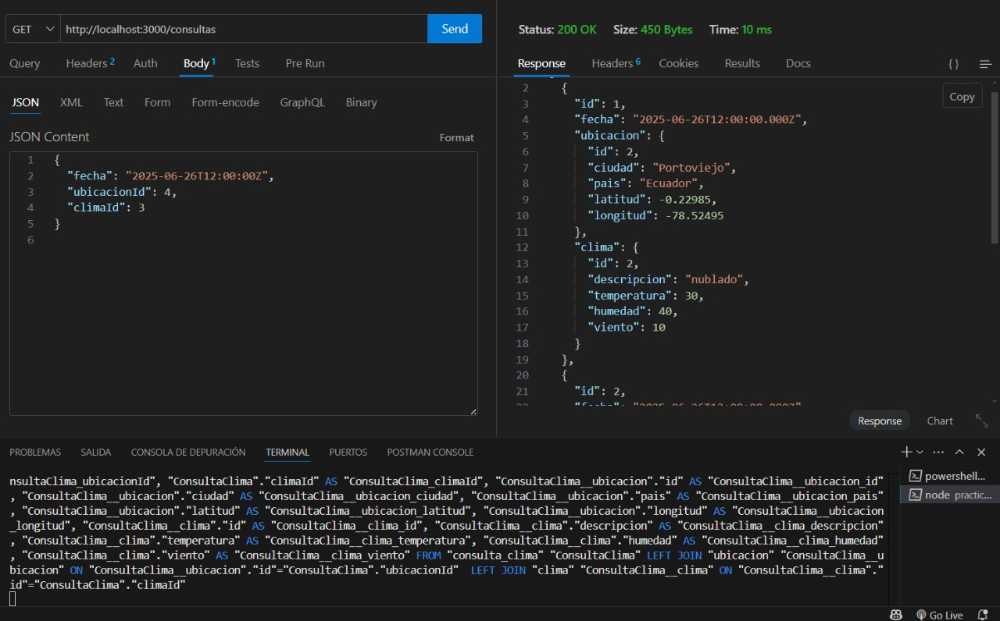

#### GET por ID
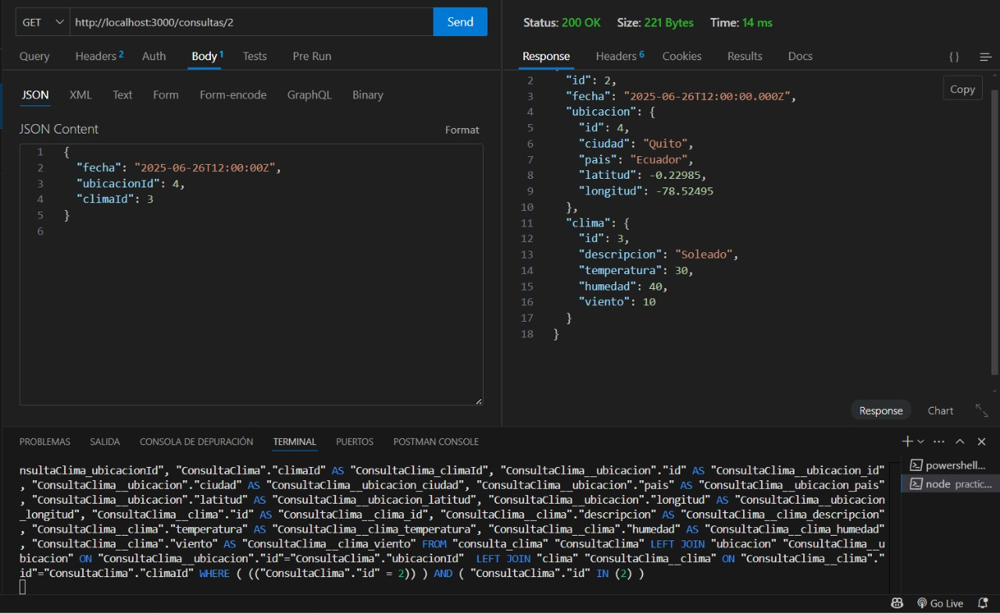

#### PUT


#### DELETE
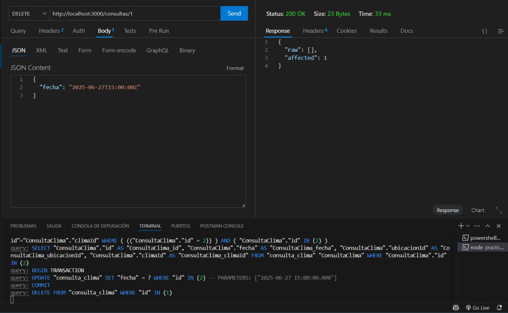


## 📁 Base de datos

Se utiliza **SQLite** por simplicidad. El archivo `clima.db` se genera automáticamente en el primer arranque si no existe.

Para explorar la base de datos puedes usar:

- [DB Browser for SQLite](https://sqlitebrowser.org/)
- Extensión de VSCode: SQLite Viewer

---

## 🧑‍💻 Autor

Proyecto desarrollado por [Maykel Menendez].
Curso [5to "A"].

---


