# 🌧️ API GraphQL - Gestión de Clima

Este proyecto es una **API GraphQL funcional** desarrollada con [NestJS](https://nestjs.com/), [Apollo Server](https://docs.nestjs.com/graphql/quick-start#apollo-sandbox), [TypeORM](https://typeorm.io/) y [GraphQL (Code-First)](https://docs.nestjs.com/graphql/quick-start). Permite gestionar información climática, incluyendo ubicaciones geográficas, condiciones meteorológicas y consultas climáticas relacionadas. Se conecta a una base de datos **SQLite** mediante TypeORM, implementando una arquitectura por capas y validaciones con class-validator.

---

## 🚀 Instalación y ejecución

### 1. Clonar el repositorio

```bash
git clone https://github.com/EZMayk/Reposity-of-Aplicaciones.git
cd Parcial_2/Practicas/practica_2
```

### 2. Instalar dependencias.

```bash
npm install
```

### 3. Ejecutar el proyecto en modo desarrollo

```bash
npm run start:dev
```

> La API estará disponible en `http://localhost:3000/graphql` y se generará automáticamente la base de datos `db.sqlite` en la carpeta del proyecto.

---

## 🔎 Exploración de la API GraphQL

Una vez en funcionamiento, accede a `http://localhost:3000/graphql` para probar los CRUD de las entidades mediante Apollo Server Playground.

---

## 📊 Entidades y operaciones

### 📍 Ubicaciones (`Ubicacion`)

#### Crear ubicación

```graphql
mutation {
  createUbicacion(createUbicacionInput: {
    ciudad: "Manta"
    pais: "Ecuador"
    latitud: -0.95
    longitud: -80.73
  }) {
    id
    ciudad
  }
}
```

#### Obtener todas

```graphql
query {
  ubicaciones {
    id
    ciudad
    pais
  }
}
```

#### Obtener por ID

```graphql
query {
  ubicacion(id: 1) {
    id
    ciudad
  }
}
```

#### Actualizar

```graphql
mutation {
  updateUbicacion(updateUbicacionInput: {
    id: 1
    ciudad: "Portoviejo"
  }) {
    id
    ciudad
  }
}
```

#### Eliminar

```graphql
mutation {
  removeUbicacion(id: 1) {
    id
    ciudad
  }
}
```

---

### ☀️ Climas (`Clima`)

#### Crear clima

```graphql
mutation {
  createClima(createClimaInput: {
    descripcion: "Soleado"
    temperatura: 30
    humedad: 60
    viento: 15
  }) {
    id
    descripcion
  }
}
```

#### Obtener todos

```graphql
query {
  climas {
    id
    descripcion
    temperatura
  }
}
```

#### Obtener por ID

```graphql
query {
  clima(id: 1) {
    id
    descripcion
  }
}
```

#### Actualizar

```graphql
mutation {
  updateClima(updateClimaInput: {
    id: 1
    descripcion: "Nublado"
  }) {
    id
    descripcion
  }
}
```

#### Eliminar

```graphql
mutation {
  removeClima(id: 1) {
    id
    descripcion
  }
}
```

---

### 📊 Consultas Climáticas (`ConsultaClima`)

> Asegúrate de tener creados previamente una ubicación y un clima.

#### Crear consulta

```graphql
mutation {
  createConsultaClima(createConsultaClimaInput: {
    fechaConsulta: "2025-07-02T18:00:00Z"
    ubicacionId: 1
    climaId: 1
  }) {
    id
    fechaConsulta
  }
}
```

#### Obtener todas

```graphql
query {
  consultasClima {
    id
    fechaConsulta
    ubicacion {
      ciudad
    }
    clima {
      descripcion
    }
  }
}
```

#### Obtener por ID

```graphql
query {
  consultaClima(id: 1) {
    id
    fechaConsulta
  }
}
```

#### Actualizar

```graphql
mutation {
  updateConsultaClima(updateConsultaClimaInput: {
    id: 1
    fechaConsulta: "2025-07-03T10:30:00Z"
  }) {
    id
    fechaConsulta
  }
}
```

#### Eliminar

```graphql
mutation {
  removeConsultaClima(id: 1) {
    id
    fechaConsulta
  }
}
```

---

## 📷 Capturas de pruebas GraphQL (Apollo Playground)

### ✅ Pruebas de `Ubicacion`

#### POST

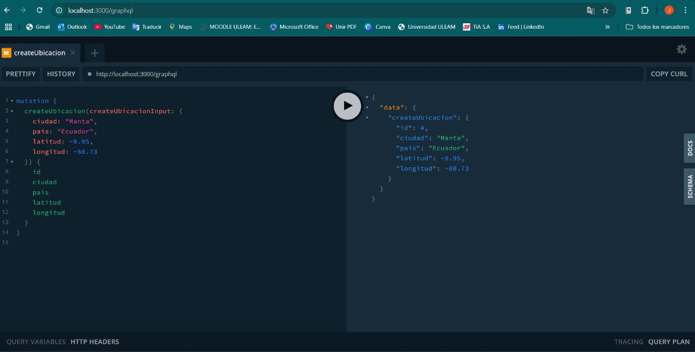

#### GET todas

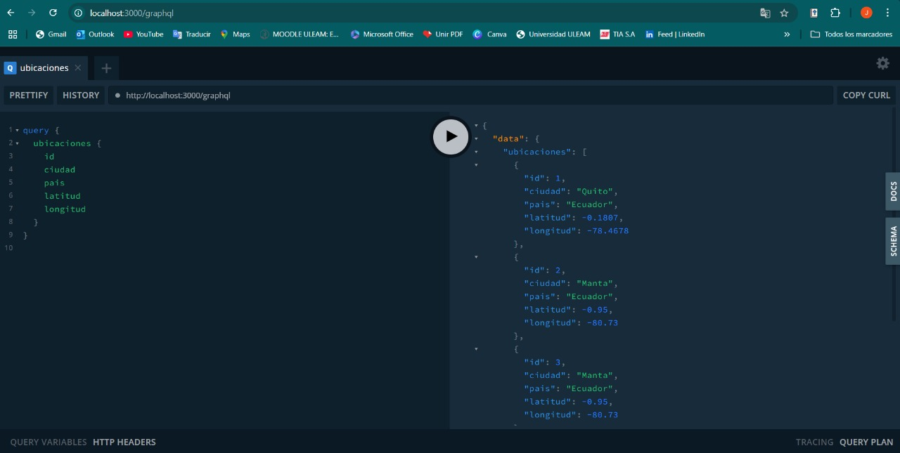

#### GET por ID

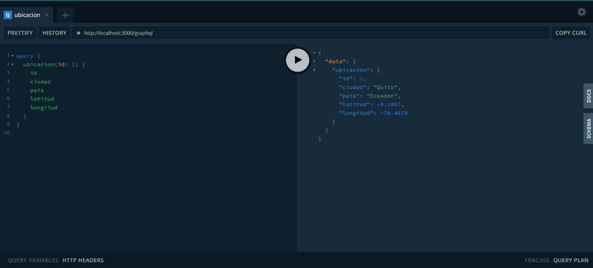

#### PUT

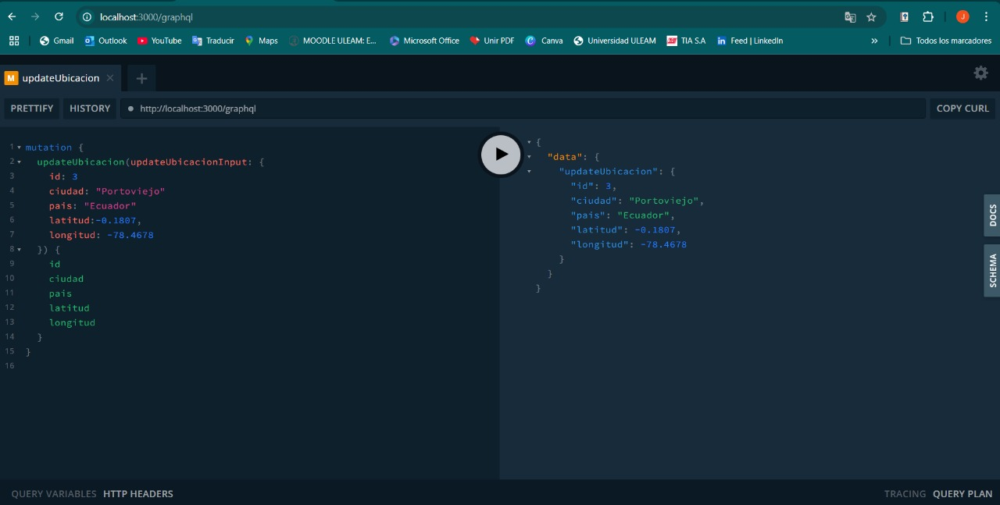

#### DELETE

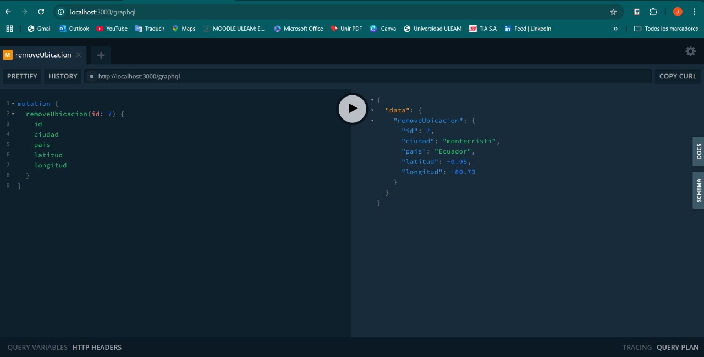

---

### ✅ Pruebas de `Clima`

#### POST

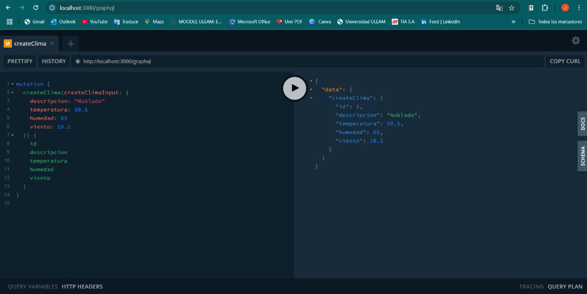

#### GET todas

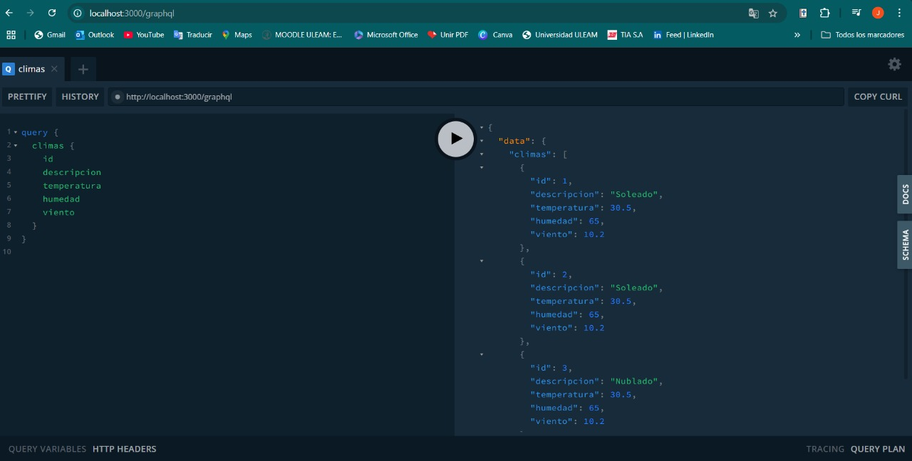

#### GET por ID

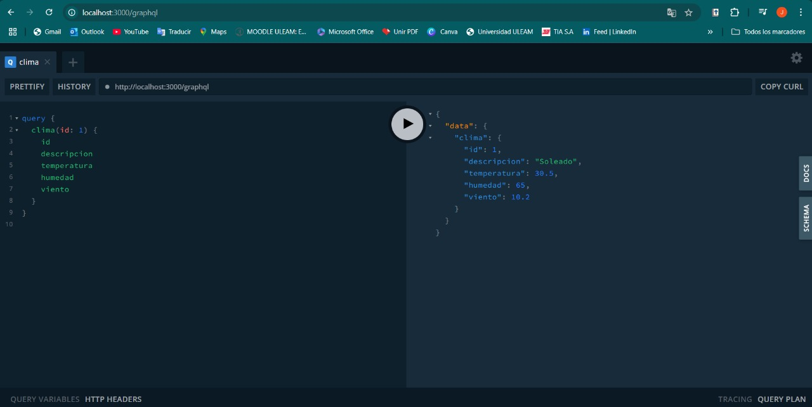

#### PUT

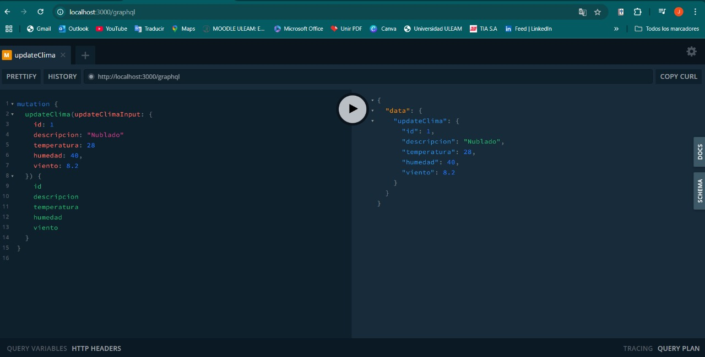

#### DELETE

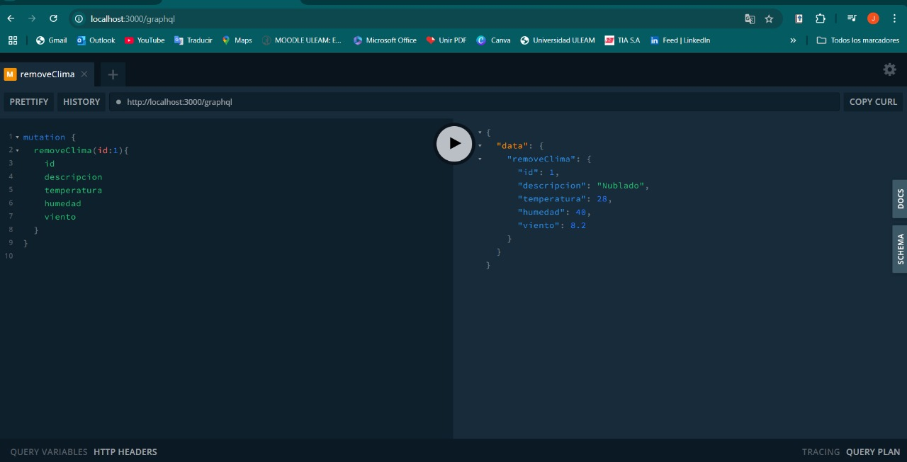

---

### ✅ Pruebas de `ConsultaClima`

#### POST

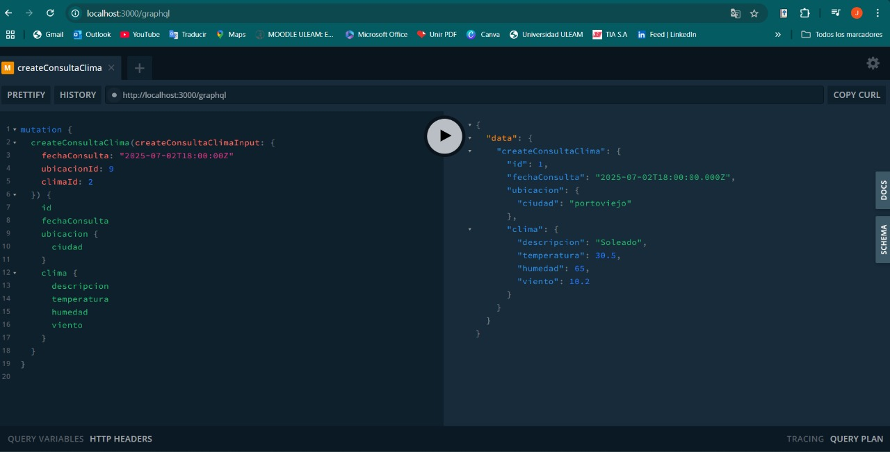

#### GET todas

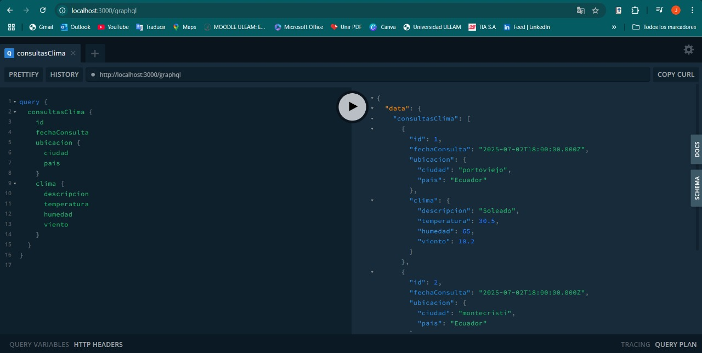

#### GET por ID

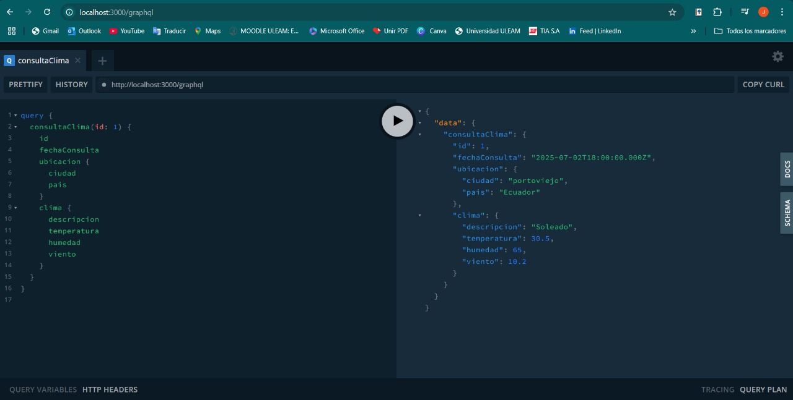

#### PUT

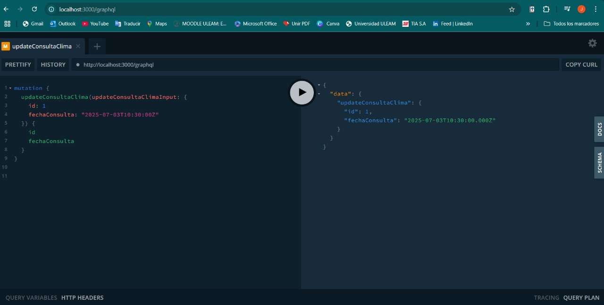

#### DELETE

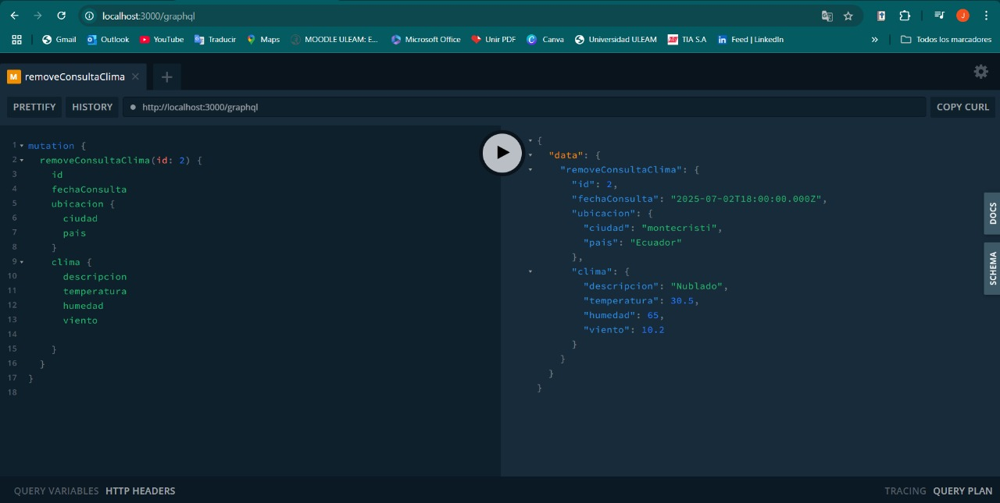

---

## 🛧️ Tecnologías utilizadas

* [NestJS](https://nestjs.com/)
* [Apollo Server](https://docs.nestjs.com/graphql/quick-start#apollo-sandbox)
* [GraphQL Code First](https://docs.nestjs.com/graphql/quick-start)
* [TypeORM](https://typeorm.io/)
* [SQLite](https://www.sqlite.org/)
* [class-validator](https://docs.nestjs.com/pipes#class-validator)

---

## 🔧 Arquitectura por capas

Cada entidad implementa:

* Entity (estructura de la tabla y decoradores GraphQL)
* DTOs de entrada con validaciones
* Service (lógica de negocio CRUD)
* Resolver (exposición vía GraphQL)

---

## 🔧 Base de datos

Se genera automáticamente un archivo `db.sqlite` al iniciar la aplicación. Puedes visualizarlo con:

* [DB Browser for SQLite](https://sqlitebrowser.org/)
* VSCode extension: SQLite Viewer

---

## 📖 Documentación de apoyo

Toda la estructura y desarrollo de esta API se basó en la documentación oficial de:

* [NestJS](https://docs.nestjs.com)
* [NestJS + GraphQL (Code First)](https://docs.nestjs.com/graphql/quick-start)
* [TypeORM](https://typeorm.io)
* [Apollo Server](https://docs.nestjs.com/graphql/quick-start#apollo-sandbox)

---

## 🗖️ Autor

Proyecto desarrollado por \[Maykel Menendez]
Curso \[5to "A"]
